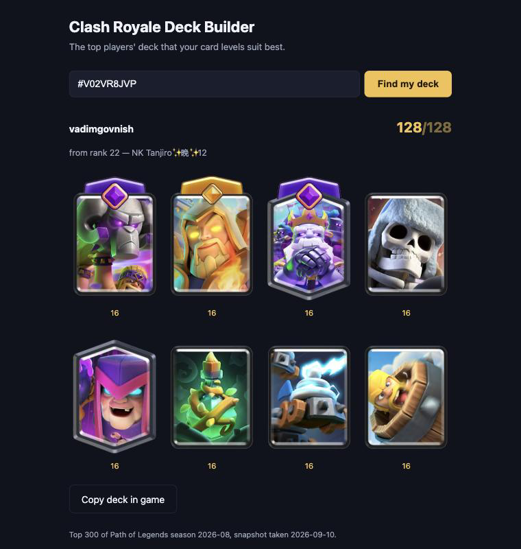

# Clash Royale Deck Builder

**Enter your player tag, get the one deck you should actually play.**

Not the best deck in the abstract — the best deck *for your card levels*, chosen
from what the top 300 ranked players are running.

**[Try it →](https://cr-deck-builder.vercel.app)**

<p align="center">
  
</p>

No database, no framework, no build step, and no dependencies — Python standard
library and vanilla JavaScript, deployed as a static page plus one serverless
function.

## How it picks

1. Take the decks of the top 300 [Path of Legends](https://clashroyale.fandom.com/wiki/Path_of_Legends)
   players, cached in a committed JSON file.
2. Discard any deck with a card you don't own, or an evolution or hero you
   haven't unlocked.
3. Score what's left by **level score** — the sum of *your* levels across the 8
   cards — and take the highest.
4. Ties go to the deck from the higher-ranked player.
5. Nothing survives? `No decks found`.

Levels are normalized to what the game displays, so a maxed Legendary and a maxed
Common both count 16 and a perfect deck scores 128. Sum the API's raw `level`
instead and the deck with the most commons wins every time.

## The interesting part

The official API doesn't expose what the app needs, so most of the work was
figuring out what it *does* expose. [`API_NOTES.md`](API_NOTES.md) documents each
finding and the evidence behind it. Three worth reading:

**`evolutionLevel` is a bitmask, not a level.** Bit 1 is the evolution, bit 2 is
the hero, so `3` means the player has both — not "evolution level 3". Verified
two ways: across all 123 cards `maxEvolutionLevel` matches exactly which art the
card has, and across 3,670 card records a hero-only card never once appears as
`evolutionLevel: 1`, which is impossible under a bitmask but routine under a
level.

**Deck order reveals what no field states.** Nothing marks a card as being played
as an evolution or a hero — the API reports only what a player *owns*, never what
they've equipped. But `currentDeck` comes back in the game's own deck order,
where slot 1 takes an evolution, slot 2 a champion or hero, and slot 3 either. So
position implies intent. The data agrees: evolution-capable cards fill 72% of
slots 1–3 against 26% of slots 4–8, and 217 of 223 decks have an
evolution-capable card in slot 1.

**The proxy rejects Python's default User-Agent.** The same request succeeded
from `curl` and 403'd from `urllib`, which is a genuinely unpleasant thing to
debug.

## Running it

```bash
cp .env.example .env      # then paste your API key in
python scripts/serve.py   # http://localhost:8000
```

An API key comes from [developer.clashroyale.com](https://developer.clashroyale.com).
Its allowed IP must be `45.79.218.79` — the RoyaleAPI proxy, which every request
goes through, since Vercel's outbound IPs aren't fixed.

`serve.py` borrows the deployed handler's own methods, so local testing exercises
the same code path Vercel runs rather than an imitation of it.

Without a browser:

```bash
python api/_lib.py '#YOURTAG'    # the whole pipeline, prints JSON
python scripts/check_logic.py    # scoring and slot rules; no network or key needed
python scripts/verify_api.py     # re-check every claim in API_NOTES.md
```

## Refreshing the cached decks

Deliberately manual — nothing refreshes on a schedule. Takes about five minutes,
since the rankings response carries no decks and each of the 300 players has to
be fetched individually.

```bash
python scripts/refresh_top_decks.py
git add api/_data/top_decks.json && git commit -m "refresh top decks" && git push
```

Pushing redeploys automatically.

## Layout

```
public/index.html             the entire frontend
api/best_deck.py              GET /api/best_deck?tag=… (serverless function)
api/_lib.py                   API client, scoring, slot rules, deck matching
api/_data/top_decks.json      the cached top-300 snapshot
scripts/refresh_top_decks.py  rebuild that snapshot
scripts/serve.py              run the site locally
scripts/check_logic.py        tests for the scoring and slot rules
scripts/verify_api.py         re-verify the API findings in API_NOTES.md
API_NOTES.md                  what the API actually returns, and how we know
```

## Deploying

The repo is zero-config for Vercel apart from one environment variable.

1. Import the repo at [vercel.com](https://vercel.com) → **Add New…** →
   **Project**. Leave **Framework Preset** as *Other* and **Root Directory** as
   `./` — there's no build step.
2. Under **Environment Variables**, add `CR_API_KEY` with your key, ticked for
   Production, Preview and Development.
3. **Deploy.**

Step 2 isn't optional: the site fetches the requesting player's cards live, so
without it every lookup fails. Environment variable changes only reach the live
site on the next deploy — **Deployments** → `…` → **Redeploy**.

## Known limitations

Both are API constraints rather than choices; `API_NOTES.md` has the evidence.

- **Evolution and hero requirements are inferred, not read.** The API reports
  ownership, never what's equipped, so requirements are deduced from deck order.
  Where a slot 3 card could be either form, nothing is required — guessing wrong
  would discard a deck you can actually field.
- **About a quarter of top decks are dropped.** They arrive with 7 cards instead
  of 8: the champion slot holds a hero, which the API has no way to represent, so
  it omits the card entirely. A card we can't see is a card we can't check.
